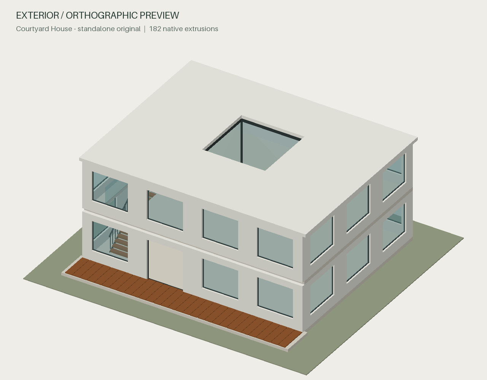

# Architecture Agent

Turn a brief, drawing set, or mixed architectural references into an editable Rhino model, retained Python source, and a browser preview.

This source beta gives a coding agent a small geometry library and a repeatable build → inspect → revise workflow. It uses `rhino3dm` and Shapely in ordinary Python. Generation does not require Rhino, Grasshopper, a Rhino plug-in, a hosted geometry server, or an API key supplied to this package. The host model still needs its normal subscription or API access.

The first backend covers planar profiles, holes, extrusions, boxes, affine placement, layers, materials and stable component identities. An agent composes these operations into buildings. It is not a replacement for every RhinoCommon operation or a construction-document authoring system.



*An original geometry fixture, generated locally without Rhino. The agent can author other retained Python designs using the same primitives.*

## Install the source plugin

Requires a host with local file execution (such as Codex), Python 3.12–3.13, and a browser. On first use the agent can create an isolated Python environment and install the pinned dependencies. Python wheels are downloaded from PyPI. Subsequent generation and viewing use the installed local libraries.

Install the tagged beta directly from GitHub:

```sh
codex plugin marketplace add Archolic95/architecture-agent@v0.3.0-beta.3
codex plugin add architecture-agent@architecture-community
```

For an extracted source archive, replace the first command’s GitHub source with the local directory containing `.agents/plugins/marketplace.json`. Restart or open a new task after installing, then invoke Architecture Agent:

> Design a compact courtyard house. Keep the source editable, show a browser preview, and give me the Rhino file.

For hybrid input, attach plans, sections, elevations or photographs and say which dimensions are known. The agent records assumptions and unresolved conflicts. Reference fidelity needs visual comparison; a valid file does not prove a correct reconstruction.

This GitHub beta is a custom marketplace release. It does not imply listing in the universal Plugins Directory. [Distribution and platform scope](docs/distribution.md) explains that separate process.

## Try the original demo

The demo and geometry helpers are inside the skill so they travel with a skill-only upload. Run these from the checkout root:

```sh
python3 plugins/architecture-agent/skills/architecture-modeling/scripts/setup.py --venv .architecture-venv
.architecture-venv/bin/python plugins/architecture-agent/skills/architecture-modeling/scripts/build_demo.py --output output/courtyard --length 14 --storey-height 3.2
python3 plugins/architecture-agent/skills/architecture-modeling/scripts/viewer/viewer_service.py --model output/courtyard/model.3dm --preview output/courtyard/model.preview.json --validation output/courtyard/validation.json --title 'Courtyard house'
```

On Windows use `py -3.13` in place of `python3` and `.architecture-venv\Scripts\python.exe` for the environment's interpreter. The viewer command prints a local URL; keep it running while viewing. It does not start or control Rhino unless you add `--allow-open` and click an Open button. Opening a file in Rhino requires Rhino to be installed.

The browser includes perspective/axonometric projection, sections, layer controls, object selection and downloads. Section cuts are uncapped display cuts. Advanced curves, surfaces and geometry without supported display data can require another backend. [Capabilities](docs/capabilities.md) records the exact boundaries.

## Share a portable viewer

Beta.3 can package a validated model and its paired preview into one HTML file:

```sh
python3 plugins/architecture-agent/skills/architecture-modeling/scripts/portable/build_portable.py --model output/courtyard/model.3dm --preview output/courtyard/model.preview.json --validation output/courtyard/validation.json --output output/courtyard-viewer --title 'Courtyard house'
```

Send `output/courtyard-viewer/model-portable.html` with the original model and retained source. The recipient downloads the HTML and opens it in a desktop browser, without Python, Rhino, a local server or external assets. The file embeds one model, its display triangles and file-verification data. It supports the existing cameras, layers, selection and uncapped cuts; arbitrary model import and native-app dispatch are unavailable in this portable file. [Portable viewer guide](plugins/architecture-agent/skills/architecture-modeling/references/portable-viewer.md)

The core controls were checked in Chrome on a bounded fixture. This does not establish inline ChatGPT/Claude rendering or attachment support on every host. The host still needs compatible Python execution to generate models and package the HTML.

The separate optional command for [filled 2D solid sections](plugins/architecture-agent/skills/architecture-modeling/references/native-sections.md), introduced in beta.2, supports capped, unmitered polygonal Extrusions. It preserves source units and reports unsupported or unresolved cuts explicitly. The fill represents combined solid occupancy; CPU and browser cuts keep their existing uncapped behavior.

## Contribute architecture skills

Add original, reusable construction recipes with retained parameters and a small test scene. A good contribution states its units, assumptions, valid parameter range, real opening geometry, and visual checks. See [CONTRIBUTING.md](CONTRIBUTING.md).

Original source is Apache-2.0. Third-party packages retain their licenses; see [THIRD-PARTY-NOTICES.md](THIRD-PARTY-NOTICES.md). This distribution contains no proprietary modeling-service code, downloaded architectural drawing set, private project history or trained model weights.
